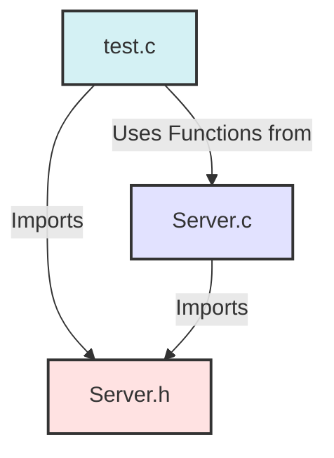
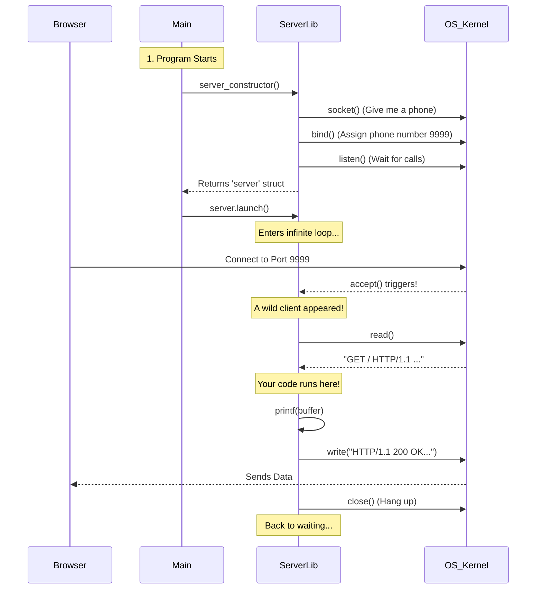

# End-to-End Project Walkthrough

This guide explains how your C Web Server works from "Top to Bottom" (Architecture) and "Start to Finish" (Runtime).

## Part 1: Architecture (The "Static" View)

Your project is split into 3 parts to keep it organized (just like Python modules).



### 1. The Blueprint (`Server.h`)
*   **Role**: The Contract.
*   **Python Equivalent**: An Abstract Base Class or just a list of class signatures.
*   **What it does**: It tells C, "Hey, there's going to lie a struct called `Server` and a function called `server_constructor`. I promise they exist."

### 2. The Implementation (`Server.c`)
*   **Role**: The Factory.
*   **Python Equivalent**: The actual `class Server:` code.
*   **What it does**:
    *   Creates the socket (the "phone").
    *   Binds it to an IP/Port (gives the phone a number).
    *   Starts listening (turns the ringer on).
    *   Returns the ready-to-use `struct Server`.

### 3. The Application (`test.c`)
*   **Role**: The User.
*   **Python Equivalent**: `app.py` or `main.py`.
*   **What it does**:
    *   Asks `Server.c` for a new server.
    *   Defines `launch()`: The logic for *what to do* when a call comes in.
    *   Runs the server.

---

## Part 2: The Lifecycle of a Request (The "Dynamic" View)

Here is what happens precisely when you run `./server` and then visit `http://localhost:9999` in your browser.



## Part 3: Deep Dive into the "Magic"

### The Struct as an Object
In Python:
```python
class Server:
    def __init__(self, port):
        self.port = port
```

In C:
```c
struct Server {
    int port;
    // ...
};

struct Server server_constructor(int port, ...) {
    struct Server server;
    server.port = port;
    return server;
}
```
**Key Difference**: In C, we manually build the box (`struct Server`) and fill it. In Python, `__init__` does it for us.

### The Function Pointer
You might wonder: *How does `server.launch()` work if structs can't have methods?*

It uses a **Function Pointer**.
1.  We defined a variable inside the struct: `void (*launch)(struct Server *server);`
2.  This variable doesn't hold data. It holds a **memory address** of a function.
3.  When we do `server.launch(...)`, C jumps to that memory address and starts executing code.
